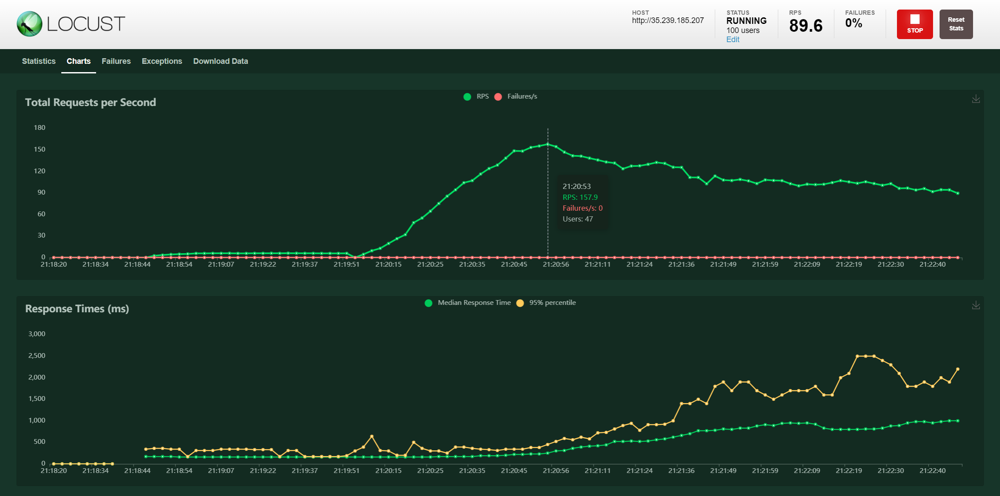
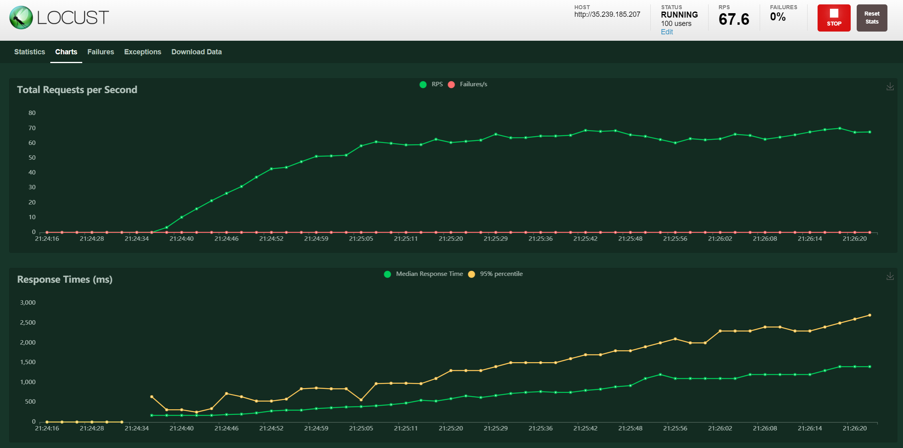
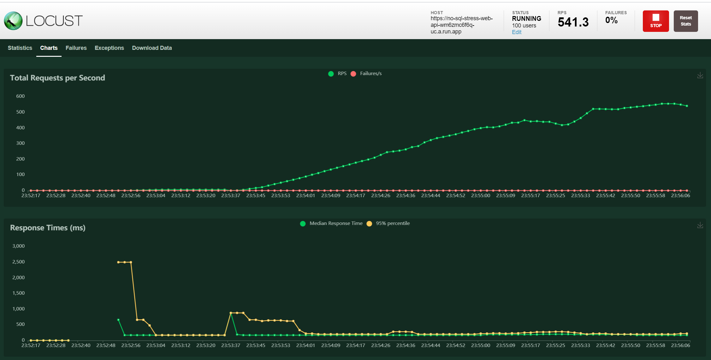
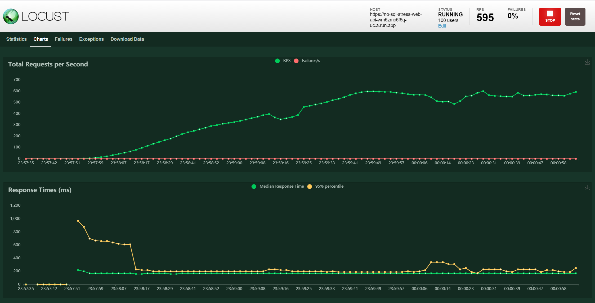
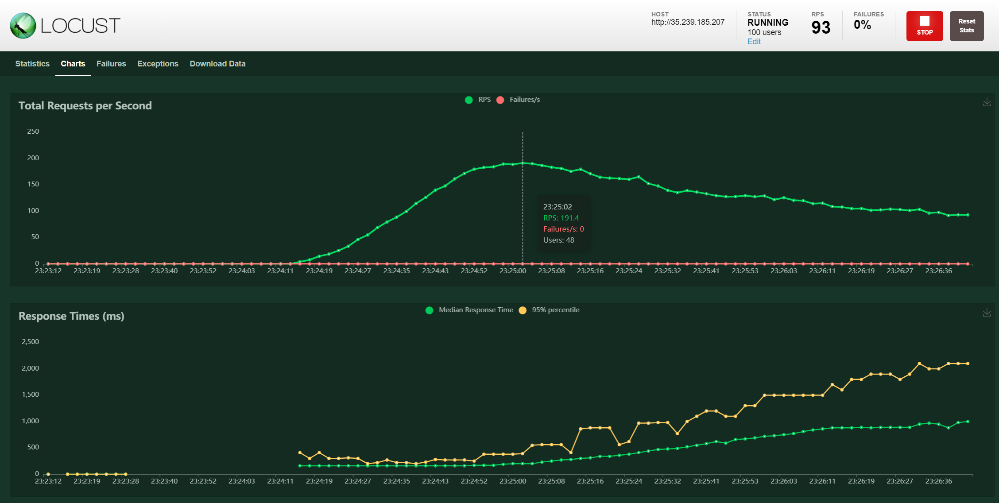
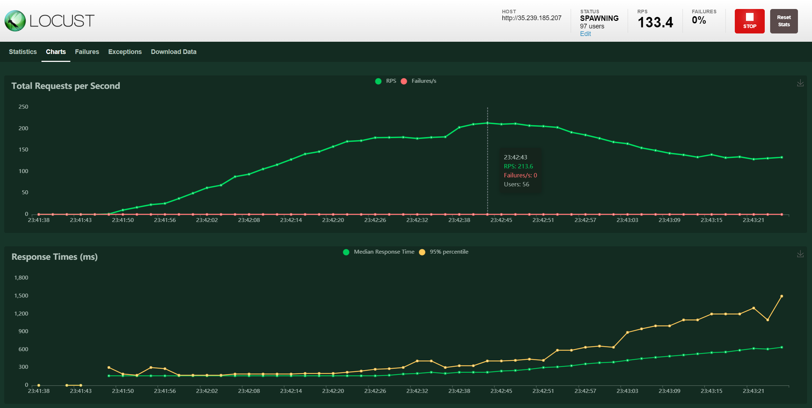

# Сравнение производительности кластеров MongoDB и Cassandra

Отчет по работе:

1. В GCP был развернут кластер Mongo из 3 реплика сетов, 3 конфиг серверов, одного сервера с процессом mongos

mongo-rs1 - машина для первого реплика сет (2 ноды плюс арбитр)<br>
mongo-rs2 - машина для второго реплика сет (2 ноды плюс арбитр)<br>
mongo-rs3 - машина для третьего реплика сет (2 ноды плюс арбитр)<br>
mongo-configsvr - машина для конфиг серверов (3 конфиг сервера)<br>
mongos - машина для работы процесса mongos<br>

Параметры каждой виртуальной машины: e2-medium (2 vCPUs, 4 GB memory)

Подробнее про развертывание кластера Mongo: [Развертывание кластера Mongo](mongo_cluster_work.md)

2. В GCP в Kubernetes Engine был развернут кластер из 3 нод Cassandra.

Параметры каждой виртуальной машины: e2-medium (2 vCPUs, 4 GB memory)

Подробнее про развертывание кластера Cassandra: [Развертывание кластера Cassandra](cassandra_work_part1.md)

3. Было написано .net web приложение, которое может записывать и читать данные из Mongo или Cassandra.<br>
Код проекта загружен на GitHub: [NoSqlStress.WebApi.sln](.net%20backend%20project/NoSqlStress.WebApi/NoSqlStress.WebApi.sln)

Интерфейс REST Api контроллеров для нагрузки данными Mongo и Cassandra:

    /// <summary>
    /// Общий интерфейс для тестирования нагрузки БД.
    /// </summary>
    public interface IStressController
    {
        /// <summary>
        /// Запись сущности.
        /// </summary>
        Task<IActionResult> WriteEntity(TestEntity entity);

        /// <summary>
        /// Чтение сущности.
        /// </summary>
        Task<IActionResult> ReadEntity(Guid id);
    }

Был создан контракт тестовой сущности. Идентификатором был выбран Guid, чтобы его использовать как ключ шардирования в Mongo. В Cassandra он использовался как Primary Key. Запись сущностей происходит по одной. Чтение происходит по Guid.

    /// <summary>
    /// Тестовая сущность
    /// </summary>
    public class TestEntity
    {
        /// <summary>
        /// Идентификатор.
        /// </summary>
        public Guid Id { get; set; }

        /// <summary>
        /// Наименование.
        /// </summary>
        public string Name { get; set; }

        /// <summary>
        /// Возраст.
        /// </summary>
        public int Age { get; set; }

        /// <summary>
        /// Описание.
        /// </summary>
        public string Description { get; set; }

        /// <summary>
        /// Адрес.
        /// </summary>
        public string Address { get; set; }

        /// <summary>
        /// Телефон.
        /// </summary>
        public string Phone { get; set; }

        /// <summary>
        /// Почта.
        /// </summary>
        public string Email { get; set; }
    }

4. В случае Cassandra .net приложение было развернуто в Kubernetes Engine. Был создан отдельный service и deployment. Для .net приложения был разрешен трафик извне Kubernetes и создан внешний ip адрес.

5. В случае Mongo .net приложение было развернуто в Cloud Run. Для того, чтобы экземпляр приложения видел Mongo сервера, развернутые в Compute Engine в GCP был создан Serverless VPC Access Connector.

В пунктах 4-5 для развертывания в том числе использовалось расширение к MS Visual Studio [Cloud Tools for Visual Studio](https://cloud.google.com/visual-studio)
Но у меня ни разу в полностью автоматическом режиме оно не сработало.
Контейнер с .net приложением собирался локально, выкладывался в Container Registry в GCP.
Далее либо через UI из него создавалось Cloud Run приложение либо модифицировался deployment в Kubernetes Engine.

Используемые скрипты:
```
docker build . -t gcr.io/subtle-anthem-307219/no-sql-stress-web-api:20210323t005400 -f .\NoSqlStress.WebApi\Dockerfile
gcloud auth login
gcloud auth configure-docker
docker push gcr.io/subtle-anthem-307219/no-sql-stress-web-api:20210323t005400
```

6. Был написан Python скрипт для нагрузочного тестирования REST Api. Использовался пакет Locust.
Код скрипта загружен на GitHub: [locustfile.py](PythonLocustStress/locustfile.py)
Тестирование проводилось с локального компьютера, нагружалось Api в GCP. Перед стартом основного теста запускался прогрев REST Api около 10-15 секунд. Далее запускался основной тест с параметрами Users = 100, Spawn Rate = 1. Тест прогонялся околок 2 минут.

Для того чтобы вставляемые данные были максимально приближены к реальным использовался пакет Faker, который имеет много встроенных стратегий генерации реальных данных (адреса, Email, числа, текст, имена и так далее)

Во обоих БД использовалась консистентность чтения и записи One (W1).
В Mongo запись и чтение производилось из шардированной коллекции. Ключ шардирования (Guid) Id.

```
use test
sh.enableSharding("test")
db.tests.ensureIndex({_id: 1})
use admin
db.runCommand({shardCollection: "test.tests", key: {_id: 1}})
```

## Результаты тестов

Для наглядности результаты представлены в виде графиков.

##### Cassandra - тест на запись (e2-medium (2 vCPUs, 4 GB memory)
##### Максимальный RPC = 158 Средний RPC = 120

##### Cassandra - тест на чтение (e2-medium (2 vCPUs, 4 GB memory)
##### Средний RPC = 70


##### Mongo - тест на запись (e2-medium (2 vCPUs, 4 GB memory)
##### Средний RPC = 540

##### Mongo - тест на чтение (e2-medium (2 vCPUs, 4 GB memory)
##### Средний RPC = 600


Так как Cassandra показала меньшую производительность на одинаковых ресурсах, то был сделан еще один прогон теста на запись, с увеличенными ресурсами ВМ.
##### Cassandra - тест на запись (e2-custom (4 vCPUs, 8 GB memory)
##### Максимальный RPC = 191 Средний RPC = 150


Попробовал сделать небольшой тюнинг драйвера Cassandra в .net, полностью отключив логгирование внутреннее в драйвере. Это позволило получить чуть более высокие результаты:
##### Cassandra - тест на запись (e2-custom (4 vCPUs, 8 GB memory)
##### Максимальный RPC = 214 Средний RPC = 160



## Итог

1. На одних и тех же ресурсах Mongo кластер с использованием шардированной коллекции быстрее чем Cassandra кластер.
2. В данной тестовой конфигурации даже увеличение ресурсов в два раза не сильно снизило отставание Cassandra от Mongo.
3. В Cassandra запись работает быстрее чем чтение. В Mongo наоборот. Чтение имеется ввиду чтение по первичному ключу.
4. В Cassandra наблюдается также точка деградации на графике записи, после которой видно снижение производительности.

<br><br>
Полезные ссылки:<br>
https://stackoverflow.com/questions/55663172/docker-container-upload-to-gcp-cloud-run-with-core-web-api-app-not-working <br>
https://codelabs.developers.google.com/codelabs/cloud-istio-aspnetcore-part1 <br>
https://cloud.google.com/tools/visual-studio/docs/deployment-wizard
<br><br>
https://stackoverflow.com/questions/59818391/can-not-connect-between-cloud-run-and-compute-engine-using-internal-ip <br>
https://cloud.google.com/vpc/docs/configure-serverless-vpc-access#creating_a_connector 
<br><br>
https://www.altoros.com/research-papers/nosql-performance-benchmark-2018-couchbase-server-v5-5-datastax-enterprise-v6-cassandra-and-mongodb-v3-6/?utm_source=xp&utm_medium=blog&utm_campaign=content