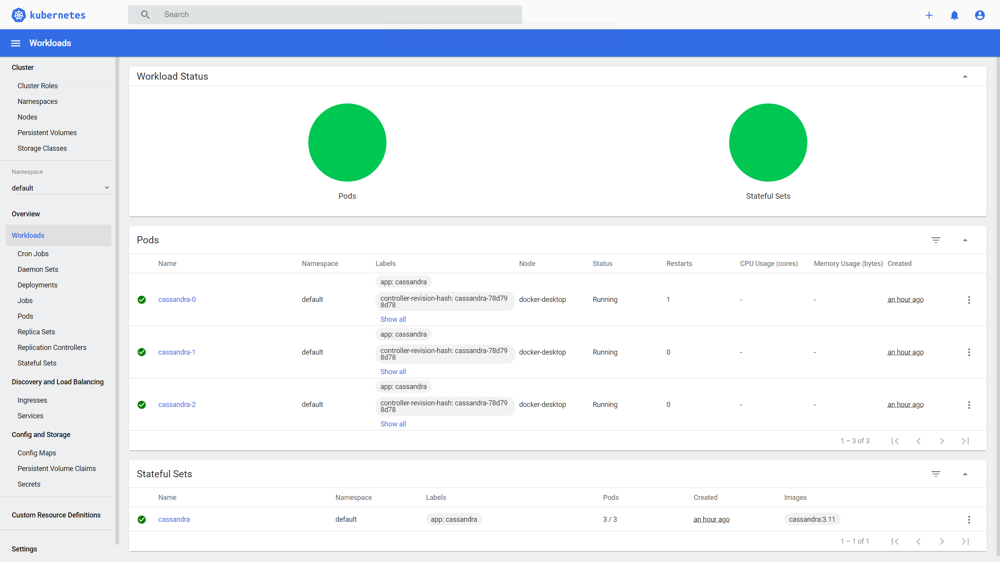
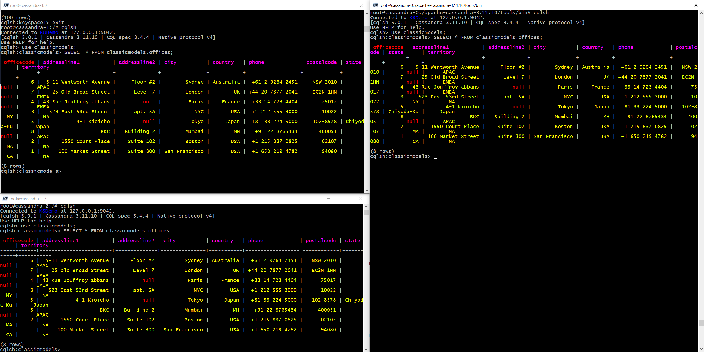
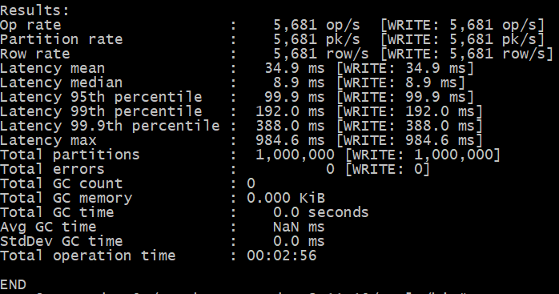
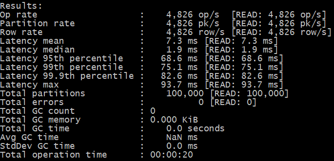

## Cassandra - часть 1

Отчет по работе:
1. Был установлен локально Kubernetes
2. Для удобства сразу был настроен Web UI (Dashboard) по инструкции на официальном сайте
3. Был поднят трехузловой кластер из БД Cassandra. Перед созданием были созданы три Persistent Volumes.

		kubectl apply -f .\pv-kube-test-0.yaml
		kubectl apply -f .\pv-kube-test-1.yaml
		kubectl apply -f .\pv-kube-test-2.yaml
		kubectl apply -f .\cassandra-service.yaml
		kubectl apply -f .\cassandra-statefulset.yaml

Сами yaml файлы:  
[pv-kube-test-0](cassandra/pv-kube-test-0.yaml) 
[cassandra-service.yaml](cassandra/cassandra-service.yaml) 
[cassandra-statefulset.yaml](cassandra/cassandra-statefulset.yaml)

4. Были протестированы запросы из демонстрации на лекции. Вставка данных была на одну из нод, чтение данных было проверено со всех нод.

5. На одной из нод Cassandra был установлен wget, скачан официальный архив Cassandra с инструментами.
6. Была запущена утилита cassandra-stress на запись и чтение

		./cassandra-stress write n=1000000
		./cassandra-stress read n=100000

Ниже результаты тестирования:

Материалы: 
https://medium.com/ksquare-inc/how-to-use-apache-cassandras-stress-tool-a-step-by-step-guide-649ea26daa5d  
https://kubernetes.io/docs/tutorials/stateful-application/cassandra/  
https://kubernetes.io/docs/tasks/access-application-cluster/web-ui-dashboard/  
https://kubernetes.io/ru/docs/reference/kubectl/cheatsheet/  
https://kubernetes.io/docs/concepts/configuration/overview/