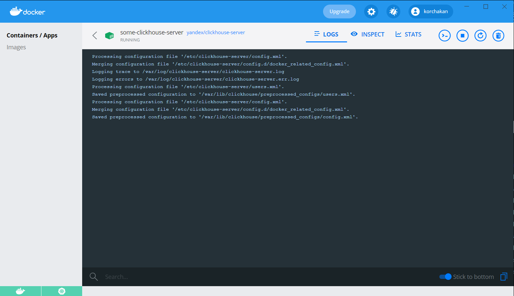
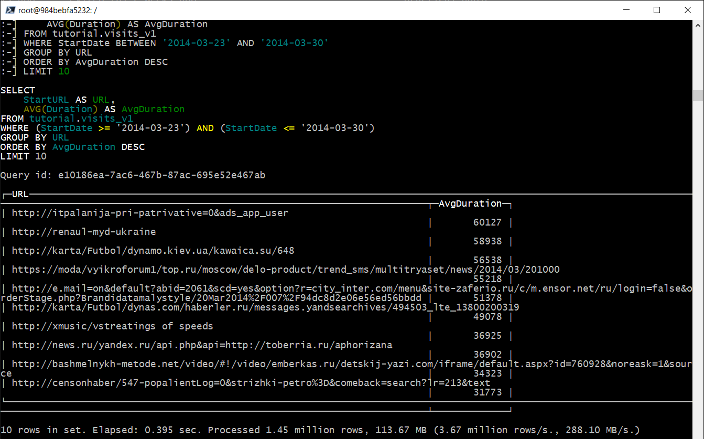
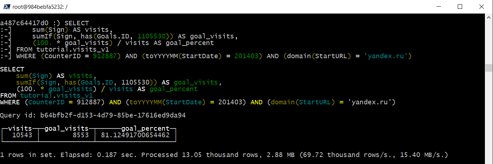

## ClickHouse

Отчет по работе:
1. Было развернуто в докере два контейнера ClickHouse Server и ClickHouse Client

		docker run -d --name some-clickhouse-server --ulimit nofile=262144:262144 yandex/clickhouse-server
		docker run -it --rm --link some-clickhouse-server:clickhouse-server yandex/clickhouse-client --host clickhouse-server

При перезапуске контейнера ClickHouse Client требовалось вручную при подключении clickhouse-client прописывать IP адрес сервера, чтобы узнать внутренний IP сервера пользовался командой:

		docker inspect -f '{{range.NetworkSettings.Networks}}{{.IPAddress}}{{end}}' some-clickhouse-server

2. В контейнере ClickHouse Clien был установлен cUrl и xz-utils для возможности скачивания и распаковки архивов с данными для загрузки в ClickHouse
3. Скачал  архивы и распаковал командами из tutorial
4. Запустил загрузку в БД командами INSERT INTO
5. Прогнал тестовые запросы на БД из tutorial  

6. Отметил впечатляющую скорость выполнения запросов, а также очень низкое потребление ресурсов ОЗУ и Процессора. Потребление ОЗУ при любых запросах включая импорт не превышало 250Мб.

Материалы: 
https://clickhouse.tech/docs/ru/getting-started/tutorial/  
https://clickhouse.tech/docs/en/interfaces/cli/  
https://hub.docker.com/r/yandex/clickhouse-server