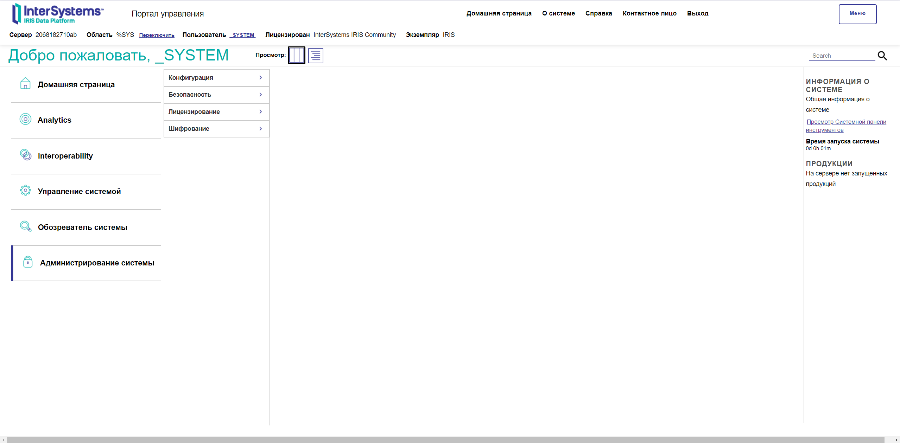
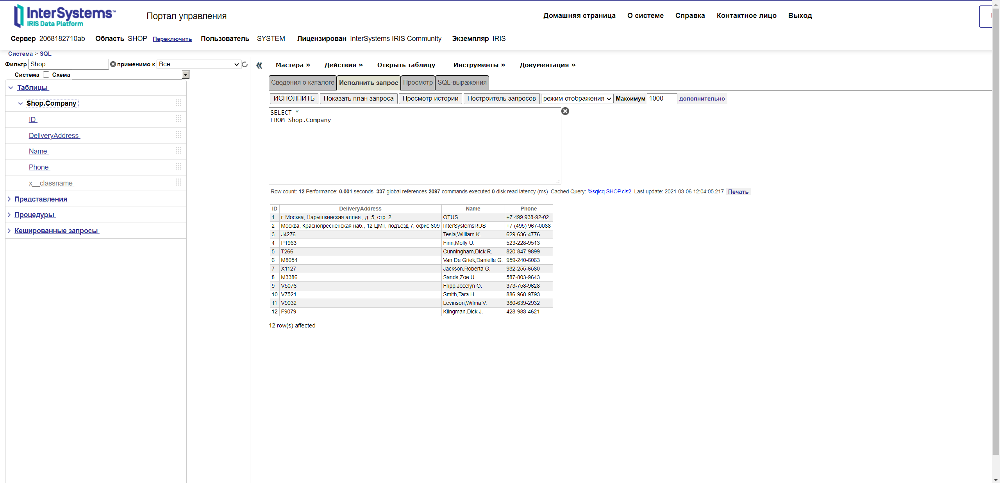
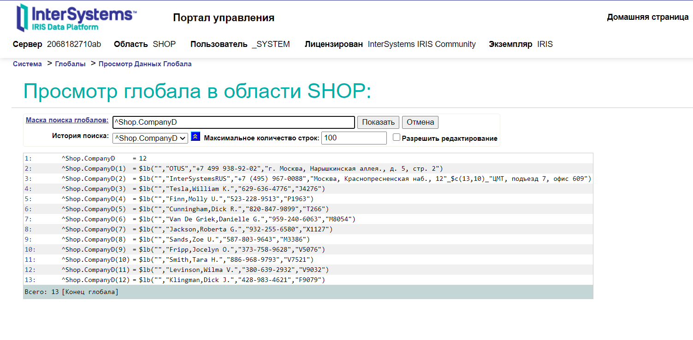
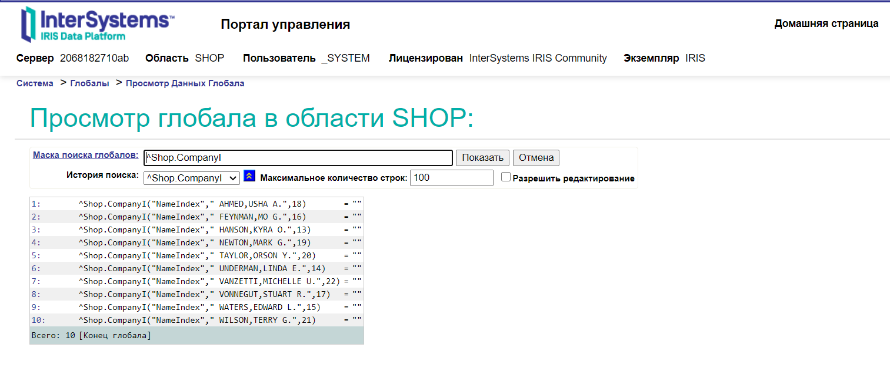

## InterSystems Cache

Отчет по работе:
1. Был запущен следующий контейнер в докере с БД InterSystems Cache

		docker run -d -p 52773:52773 --name intersystems_iris intersystemsdc/iris-community:2020.4.0.524.0-zpm

2. По инструкции из материалов была создана база данных, таблица в ней через VS Code, табица была заполнена данными.

3. Далее был создан уникальный индекс на поле Name.

