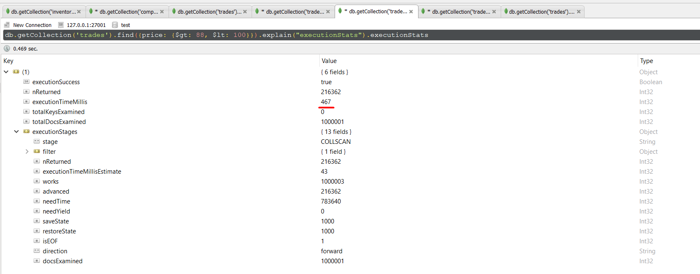
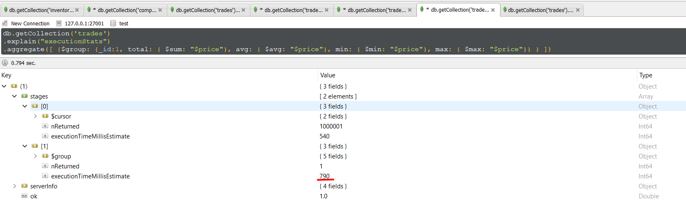
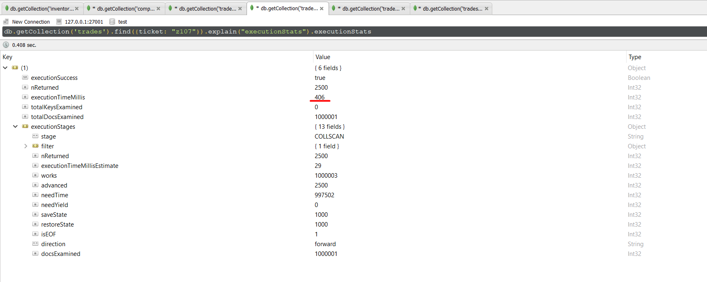
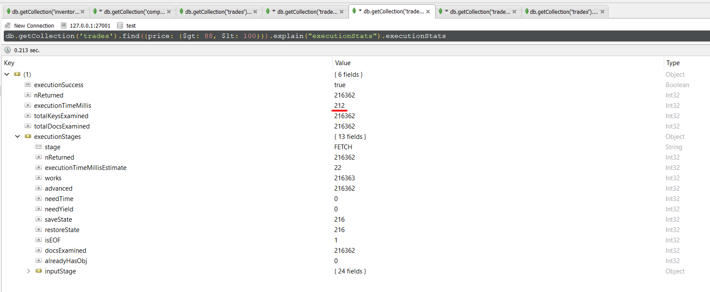
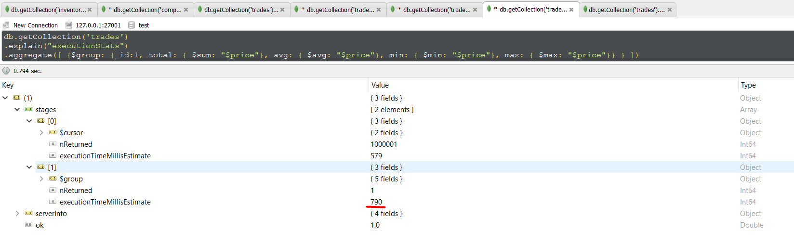
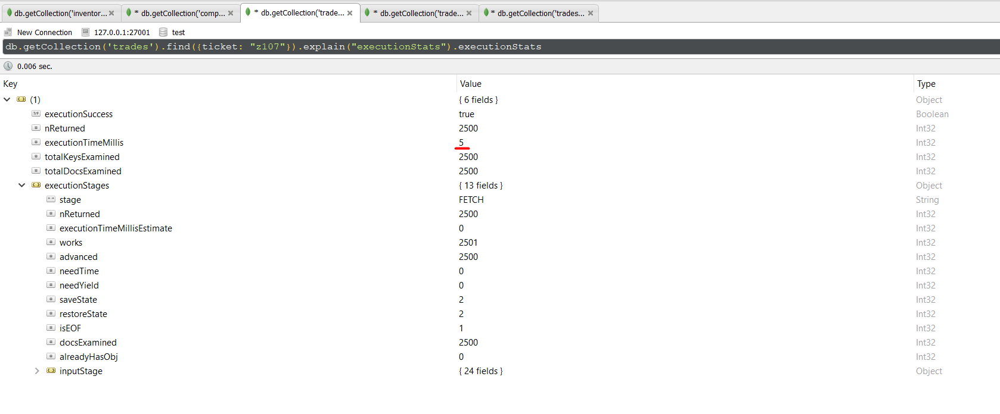
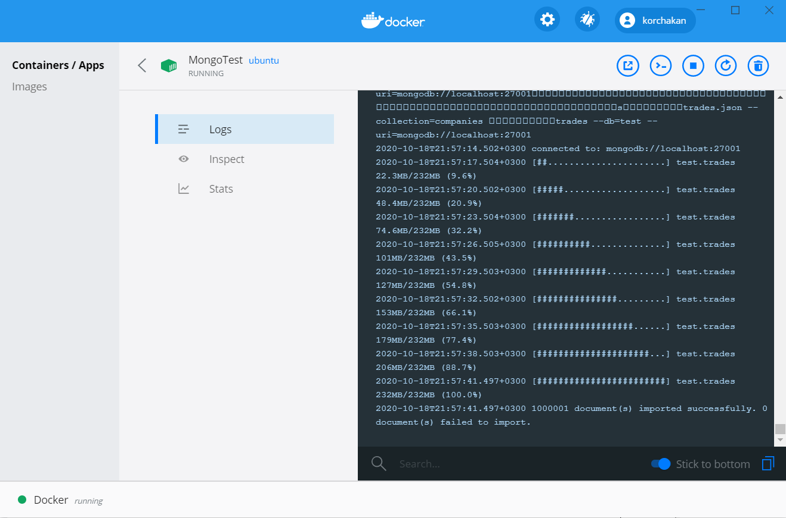

## Базовые возможности MongoDB

Отчет по работе:
1. Сделал pull в докере образа Ubuntu
1. Контейнер запускал следующим скриптом

		docker run -d -p 27001:27001 --name MongoTest -it ubuntu 

1. Поставил в докере на Ubuntu все пакеты, чтоб можно было поставить MongoDB *(vim ставил для просмотра конфигов)*

		apt-get update 
		&& apt-get -y install sudo 
		&& apt-get install -y wget \
		&& rm -rf /var/lib/apt/lists/*
		&& sudo apt-get install gnupg
		&& sudo apt install vim 

1. Поставил успешно MongoDB 4.4.1 скриптами из материалов
1. Чтобы MongoDB была доступна извне запускал с ключом `--bind_ip_all`
1. Повставлял данные в MongoDB через консоль в Linux, попробовал запросы
1. Далее скопировал в контенер json с таблицей trades с 1млн записей ([ссылка](https://github.com/ozlerhakan/mongodb-json-files))

		docker cp trades.json MongoTest:/usr/share/trades.json

1. Загрузил в MongoDB командой

		mongoimport --file=trades.json --collection=trades --db=test --uri=mongodb://localhost:27001

1. Успешно подключился к MongoDB с Windows хост машины через [Robo3T](https://robomongo.org/)
1. Проверил запросы без индексов по разным колонкам

1. Создал индексы на price и на ticket `db.trades.createIndex( { price: 1 } )` и `db.trades.createIndex( { ticket: 1 } )`
1. Производительность возросла на порядок (но для операции аггреации не изменилась, так как все равно требуется сканировать всю таблицу)

В аттаче также скрин докера с работающим контейнером:
