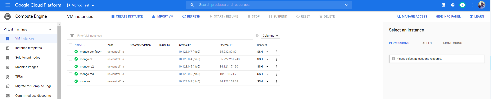
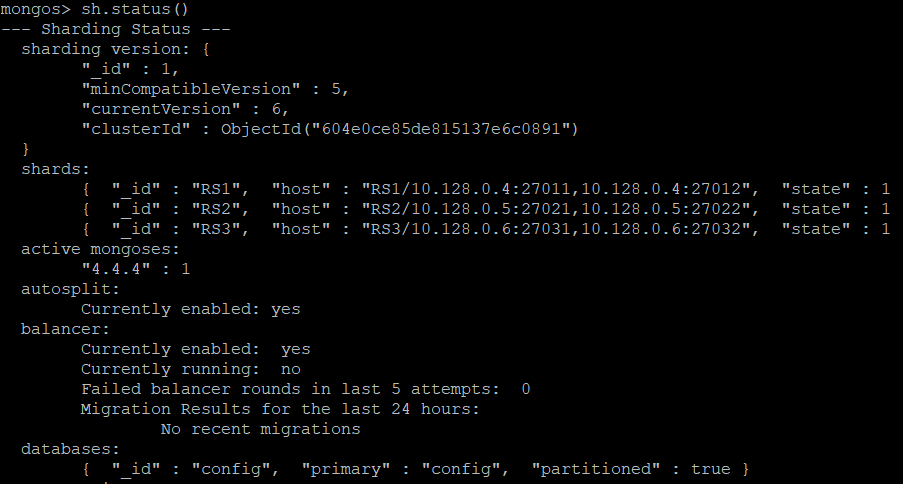
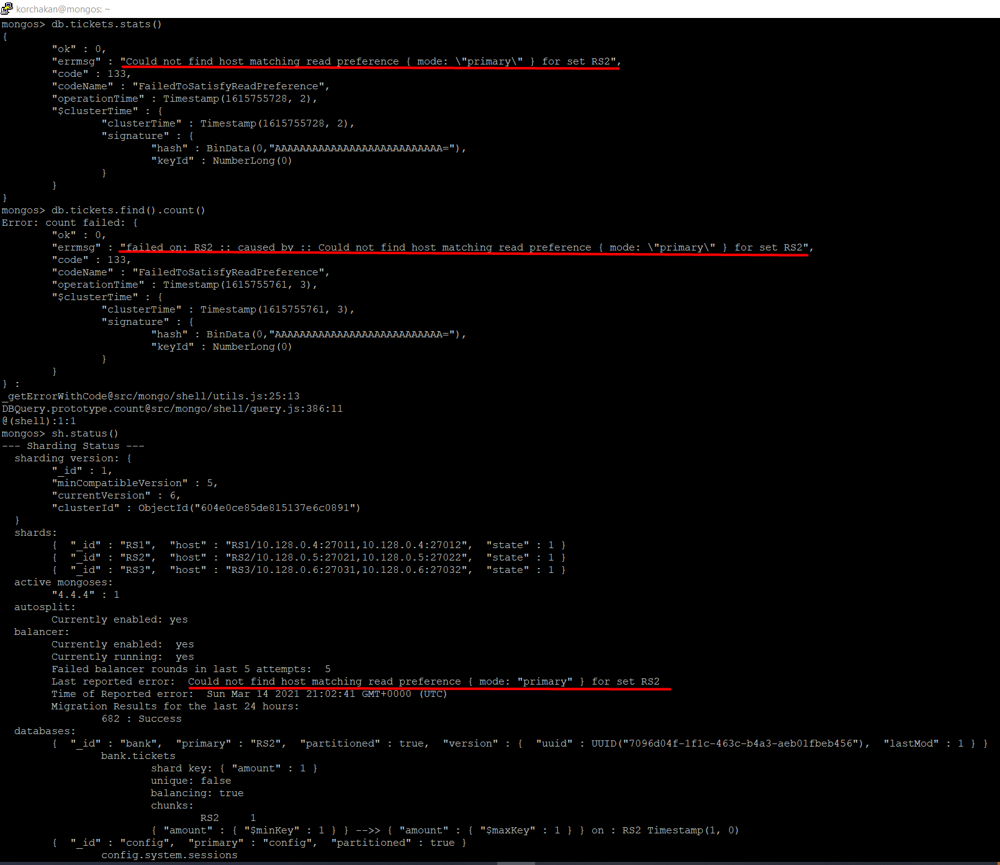

## Кластерные возможности MongoDB

Отчет по работе:
1. В Google Cloud Platform было развернуто 5 виртуальных машин со следующим предназначением:

mongo-rs1 - машина для первого реплика сет (2 ноды плюс арбитр) 
mongo-rs2 - машина для второго реплика сет (2 ноды плюс арбитр) 
mongo-rs3 - машина для третьего реплика сет (2 ноды плюс арбитр) 
mongo-configsvr - машина для конфиг серверов (3 конфиг сервера) 
mongos - машина для работы процесса mongos 

Для возможности работы в локальном PowerShell был установлен Google Cloud Platform SDK.  
Команды использованные для развертывания виртуальных машин в GCP

		gcloud beta compute --project=subtle-anthem-307219 instances create mongo-rs1 --zone=us-central1-a --machine-type=e2-medium --subnet=default --network-tier=PREMIUM --maintenance-policy=MIGRATE --service-account=1033003911229-compute@developer.gserviceaccount.com --image=ubuntu-2004-focal-v20210223 --image-project=ubuntu-os-cloud --boot-disk-size=10GB --boot-disk-type=pd-ssd --boot-disk-device-name=mongo --no-shielded-secure-boot --shielded-vtpm --shielded-integrity-monitoring --reservation-affinity=any

		gcloud beta compute --project=subtle-anthem-307219 instances create mongo-rs2 --zone=us-central1-a --machine-type=e2-medium --subnet=default --network-tier=PREMIUM --maintenance-policy=MIGRATE --service-account=1033003911229-compute@developer.gserviceaccount.com --image=ubuntu-2004-focal-v20210223 --image-project=ubuntu-os-cloud --boot-disk-size=10GB --boot-disk-type=pd-ssd --boot-disk-device-name=mongo --no-shielded-secure-boot --shielded-vtpm --shielded-integrity-monitoring --reservation-affinity=any

		gcloud beta compute --project=subtle-anthem-307219 instances create mongo-rs3 --zone=us-central1-a --machine-type=e2-medium --subnet=default --network-tier=PREMIUM --maintenance-policy=MIGRATE --service-account=1033003911229-compute@developer.gserviceaccount.com --image=ubuntu-2004-focal-v20210223 --image-project=ubuntu-os-cloud --boot-disk-size=10GB --boot-disk-type=pd-ssd --boot-disk-device-name=mongo --no-shielded-secure-boot --shielded-vtpm --shielded-integrity-monitoring --reservation-affinity=any

		gcloud beta compute --project=subtle-anthem-307219 instances create mongo-configsvr --zone=us-central1-a --machine-type=e2-medium --subnet=default --network-tier=PREMIUM --maintenance-policy=MIGRATE --service-account=1033003911229-compute@developer.gserviceaccount.com --image=ubuntu-2004-focal-v20210223 --image-project=ubuntu-os-cloud --boot-disk-size=10GB --boot-disk-type=pd-ssd --boot-disk-device-name=mongo --no-shielded-secure-boot --shielded-vtpm --shielded-integrity-monitoring --reservation-affinity=any

		gcloud beta compute --project=subtle-anthem-307219 instances create mongos --zone=us-central1-a --machine-type=e2-medium --subnet=default --network-tier=PREMIUM --maintenance-policy=MIGRATE --service-account=1033003911229-compute@developer.gserviceaccount.com --image=ubuntu-2004-focal-v20210223 --image-project=ubuntu-os-cloud --boot-disk-size=10GB --boot-disk-type=pd-ssd --boot-disk-device-name=mongo --no-shielded-secure-boot --shielded-vtpm --shielded-integrity-monitoring --reservation-affinity=any

2. На всех виртуальных машинах был установлено MongoDb

		wget -qO - https://www.mongodb.org/static/pgp/server-4.4.asc | sudo apt-key add - && echo "deb [ arch=amd64,arm64 ] https://repo.mongodb.org/apt/ubuntu focal/mongodb-org/4.4 multiverse" | sudo tee /etc/apt/sources.list.d/mongodb-org-4.4.list && sudo apt-get update && sudo apt-get install -y mongodb-org

3. На машине с конфиг серверами было запущено 3 процесса монги с параметром configsvr

		mongod --configsvr --dbpath /home/mongo/dbc1 --port 27001 --replSet RScfg --fork --logpath /home/mongo/dbc1/dbc1.log --pidfilepath /home/mongo/dbc1/dbc1.pid --bind_ip_all
		mongod --configsvr --dbpath /home/mongo/dbc2 --port 27002 --replSet RScfg --fork --logpath /home/mongo/dbc2/dbc2.log --pidfilepath /home/mongo/dbc2/dbc2.pid --bind_ip_all
		mongod --configsvr --dbpath /home/mongo/dbc3 --port 27003 --replSet RScfg --fork --logpath /home/mongo/dbc3/dbc3.log --pidfilepath /home/mongo/dbc3/dbc3.pid --bind_ip_all

4. Был инициализированы конфиг сервера командой:

		rs.initiate{"_id" : "RScfg", configsvr: true, members : [{"_id" : 0, priority : 3, host : "10.128.0.7:27001"},{"_id" : 1, host : "10.128.0.7:27002"},{"_id" : 2, host : "10.128.0.7:27003"}]});

5. На трех машинах mongo-rs1 / mongo-rs2 / mongo-rs3 было запущено также по три процесса монги

		mongod --shardsvr --dbpath /home/mongo/db1 --port 27011 --replSet RS1 --fork --logpath /home/mongo/db1/db1.log --pidfilepath /home/mongo/db1/db1.pid --bind_ip_all
		mongod --shardsvr --dbpath /home/mongo/db2 --port 27012 --replSet RS1 --fork --logpath /home/mongo/db2/db2.log --pidfilepath /home/mongo/db2/db2.pid --bind_ip_all
		mongod --shardsvr --dbpath /home/mongo/db3 --port 27013 --replSet RS1 --fork --logpath /home/mongo/db3/db3.log --pidfilepath /home/mongo/db3/db3.pid --bind_ip_all

		mongod --shardsvr --dbpath /home/mongo/db1 --port 27021 --replSet RS2 --fork --logpath /home/mongo/db1/db1.log --pidfilepath /home/mongo/db1/db1.pid --bind_ip_all
		mongod --shardsvr --dbpath /home/mongo/db2 --port 27022 --replSet RS2 --fork --logpath /home/mongo/db2/db2.log --pidfilepath /home/mongo/db2/db2.pid --bind_ip_all
		mongod --shardsvr --dbpath /home/mongo/db3 --port 27023 --replSet RS2 --fork --logpath /home/mongo/db3/db3.log --pidfilepath /home/mongo/db3/db3.pid --bind_ip_all

		mongod --shardsvr --dbpath /home/mongo/db1 --port 27031 --replSet RS3 --fork --logpath /home/mongo/db1/db1.log --pidfilepath /home/mongo/db1/db1.pid --bind_ip_all
		mongod --shardsvr --dbpath /home/mongo/db2 --port 27032 --replSet RS3 --fork --logpath /home/mongo/db2/db2.log --pidfilepath /home/mongo/db2/db2.pid --bind_ip_all
		mongod --shardsvr --dbpath /home/mongo/db3 --port 27033 --replSet RS3 --fork --logpath /home/mongo/db3/db3.log --pidfilepath /home/mongo/db3/db3.pid --bind_ip_all

6. На трех машинах mongo-rs1 / mongo-rs2 / mongo-rs3 был инициализирован реплика сет:

		rs.initiate({"_id" : "RS1", members : [{"_id" : 0, priority : 3, host : "10.128.0.4:27011"},{"_id" : 1, host : "10.128.0.4:27012"},{"_id" : 2, host : "10.128.0.4:27013", arbiterOnly : true}]});
		rs.initiate({"_id" : "RS2", members : [{"_id" : 0, priority : 3, host : "10.128.0.5:27021"},{"_id" : 1, host : "10.128.0.5:27022"},{"_id" : 2, host : "10.128.0.5:27023", arbiterOnly : true}]});
		rs.initiate({"_id" : "RS3", members : [{"_id" : 0, priority : 3, host : "10.128.0.6:27031"},{"_id" : 1, host : "10.128.0.6:27032"},{"_id" : 2, host : "10.128.0.6:27033", arbiterOnly : true}]});

7. На машине mongos был запущен процесс mongos с определением конфиг серверов, а далее были добавлены все три реплика сеты командой addShard

		mongos --configdb RScfg/10.128.0.7:27001,10.128.0.7:27002,10.128.0.7:27003 --port 27000 --bind_ip_all
		sh.addShard("RS1/10.128.0.4:27011,10.128.0.4:27012,10.128.0.4:27013")
		sh.addShard("RS2/10.128.0.5:27021,10.128.0.5:27022,10.128.0.5:27023")
		sh.addShard("RS3/10.128.0.6:27031,10.128.0.6:27032,10.128.0.6:27033")

8. Был проверен статус кластера командой sh.status()

9. Были остановлены все сервера для настройки аутентификации (сначала mongos, далее конфиг сервер, далее все реплика сеты). Для безопасной работы внутри кластера при запуске заново всех процессов использовался параметр --keyFile.
KeyFile был сгенерирован командой:

		openssl rand -base64 756

Для перенастройки кластера с использование аутентификации использалась официальная инструкция: https://docs.mongodb.com/manual/tutorial/enforce-keyfile-access-control-in-existing-sharded-cluster/

Для того чтобы скопировать один и тот же KeyFile на все машины был использован WinSCP, чтобы с помощью него можно было заходить на машины предварительно был сгенерирован SSH ключ с помощью PyttyGen по инструкции и добавлен в GCP на каждую машину: https://winscp.net/eng/docs/guide_google_compute_engine

10. На каждый шард были добавлены пользовали для локального управления шардом.

		db.createRole(
			{      
			 role: "superRoot",      
			 privileges:[
				{ resource: {anyResource:true}, actions: ["anyAction"]}
			 ],      
			 roles:[] 
			}
		)
		db.createUser({      
			 user: "superAdmin",      
			 pwd: "*****",      
			 roles: ["superRoot"] 
		})
		db.createUser(
		  {
			user: "dbAdmin",
			pwd: "*****",
			roles: [ { role: "userAdminAnyDatabase", db: "admin" } ]
		  }
		)

11. На mongos также был добавлен пользователь с ролью clusterAdmin.

		db.createUser(
		  {
			"user" : "clusterSuperAdmin",
			"pwd" : "*****",
			roles: [ { "role" : "clusterAdmin", "db" : "admin" } ]
		  }
		)

12. После данной операции все действия внутри консоли mongo теперь требуют аутентификацию.

13. Далее по материалам были сгенерены данные и зашардирована коллекция tickets.

		db.runCommand({shardCollection: "bank.tickets", key: {amount: 1}})

14. Попробовал останавливать процессы внутри реплика сетов, все стандартно оставшаяся Secondary нода становится Primary, при поднятии ноды с большим приоритетом происходят перевыборы и она опять становится Primary.

15. Более интересно если уронить полностью машину с реплика сетом, на которую была шардирована коллекция, то операция count или find или stats не будет выполняться.

