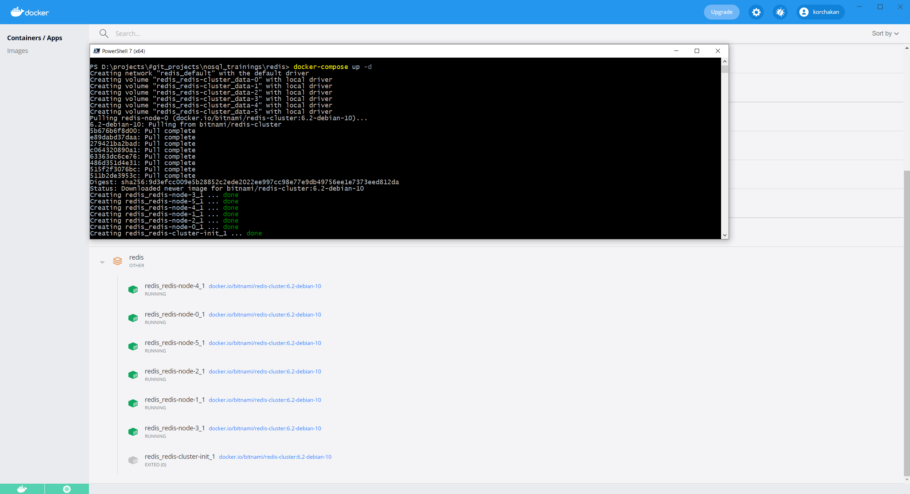
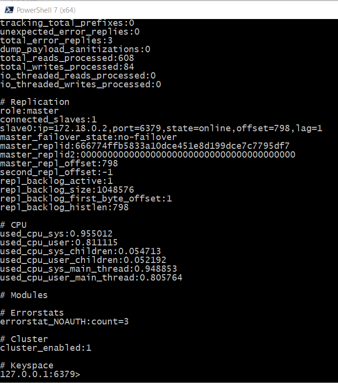
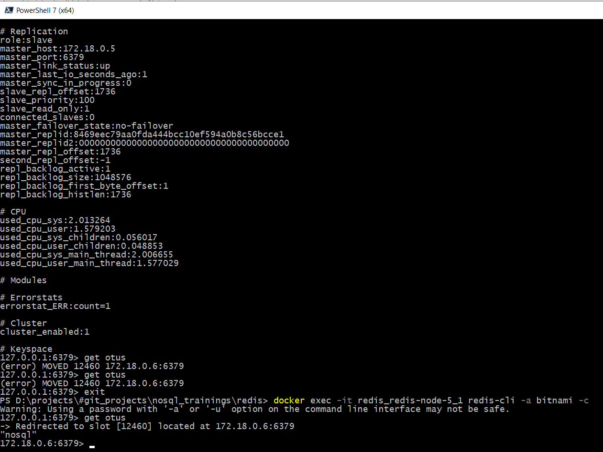
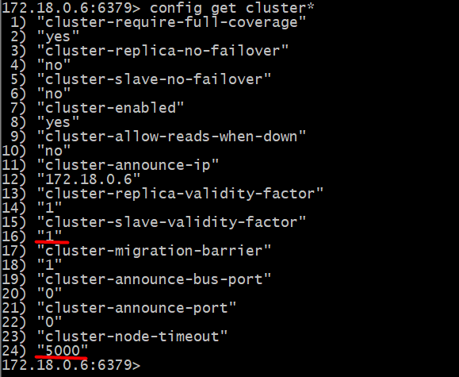
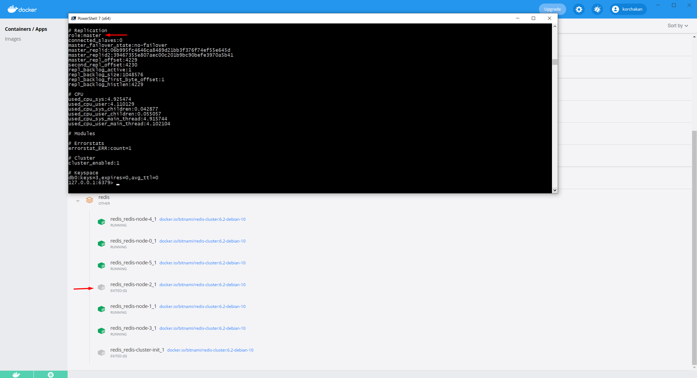

## Redis

Отчет по работе:
1. Был запущен шардированный отказоустойчивый кластер Redis из 6 нод. Запуск производился в docker из готового docker-compose файла: [docker-compose.yml](redis/docker-compose.yml)

2. Были протестированы Set/Get ключей с их редиректом на другие мастер ноды с параметром подключения __-с__

3. Также были исправлены дефолтные таймауты определения down состояния ноды

4. Попробовал остановить контейнер с master нодой. Ожидаемо slave нода становится master c нулем подключенных slave нод. А при поднятии ноды она поднимается уже как slave нода.

Материалы:  
https://github.com/bitnami/bitnami-docker-redis-cluster  
https://hub.docker.com/_/redis  
https://kb.objectrocket.com/redis/how-to-use-the-redis-to-store-json-data-1545